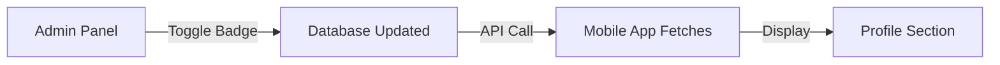

# Custom Pages Dynamic Management System

Complete system to control which pages appear in website footer and mobile app profile section from a single admin panel.

## 🎯 Overview

This system allows you to:
- Create custom pages (About Us, Privacy Policy, Terms & Conditions, etc.)
- Control which pages show in **Website Footer**
- Control which pages show in **Mobile App Profile**
- Toggle visibility with a single click
- Manage page order for both platforms

## 📊 Database Changes

### New Column Added
```sql
ALTER TABLE `custom_pages` 
ADD COLUMN `show_in_app` BOOLEAN DEFAULT FALSE AFTER `show_in_footer`;
```

### Table Structure
- `show_in_footer` → Controls website footer visibility
- `show_in_app` → Controls mobile app profile visibility
- `order_id` → Controls display order (ascending)
- `status` → Must be 'published' to show

## 🔧 Setup Instructions

### Step 1: Run Database Migration
```bash
# Open phpMyAdmin or MySQL CLI
# Execute: database/add_show_in_app_column.sql
```

Or run directly:
```sql
SOURCE c:/xampp/htdocs/database/add_show_in_app_column.sql
```

### Step 2: Admin Panel
Go to: `http://localhost/admin/pages.php`

**Features:**
- ✅ New column "Show in App" with toggle badge
- ✅ Click badge to toggle visibility (Green = Yes, Gray = No)
- ✅ Show in Footer: Green badge → Website footer
- ✅ Show in App: Blue badge → Mobile app profile

### Step 3: Mobile App Updates
The app automatically fetches pages from the API endpoint.

**Files Updated:**
- `lib/models/custom_page.dart` → Data model
- `lib/services/custom_pages_service.dart` → API service
- `lib/providers/custom_pages_provider.dart` → Riverpod provider
- `lib/screens/tabs/profile_tab/settings.dart` → UI display

## 📱 How It Works

### Website Footer
Location: `includes/footer.php`
```php
$footer_pages = $db->fetchAll("
    SELECT title, slug 
    FROM custom_pages 
    WHERE show_in_footer = 1 
    AND status = 'published' 
    ORDER BY order_id ASC, title ASC
");
```

### Mobile App Profile
Location: `news_app/lib/screens/tabs/profile_tab/settings.dart`
```dart
// Fetches from: api/app/get-app-pages.php
final customPagesAsync = ref.watch(customPagesProvider);

// Auto-updates every 30 minutes
```

## 🛠️ API Endpoint

**URL:** `http://localhost/api/app/get-app-pages.php`

**Response:**
```json
{
  "success": true,
  "pages": [
    {
      "id": 1,
      "title": "About Us",
      "slug": "about-us",
      "url": "http://localhost/page.php?slug=about-us",
      "type": "text",
      "description": "Learn more about us",
      "order": 1
    }
  ],
  "count": 1
}
```

## 🎨 Admin Panel Usage

### Create New Page
1. Click "Add New Page" button
2. Fill in title, slug, content
3. Set Order ID (lower numbers appear first)
4. Click "Show in Footer" badge to enable website visibility
5. Click "Show in App" badge to enable app visibility
6. Set status to "Published"
7. Save

### Toggle Visibility
**Quick Toggle:**
- Click the "Show in Footer" badge → Toggle website visibility
- Click the "Show in App" badge → Toggle app visibility
- Page refreshes automatically
- See instant feedback (color changes)

### Badge Colors
- **Green** (Show in Footer = Yes) → Appears in website footer
- **Blue** (Show in App = Yes) → Appears in mobile app
- **Gray** → Disabled for that platform

## 📋 Common Page Setup

### Typical Pages to Enable

| Page Title | Show in Footer | Show in App |
|-----------|----------------|-------------|
| About Us | ✅ Yes | ✅ Yes |
| Privacy Policy | ✅ Yes | ✅ Yes |
| Terms & Conditions | ✅ Yes | ✅ Yes |
| Contact Us | ✅ Yes | ❌ No (separate contact form) |
| Disclaimer | ✅ Yes | ✅ Yes |
| Cookie Policy | ✅ Yes | ✅ Yes |
| Advertise With Us | ✅ Yes | ❌ No |
| Careers | ✅ Yes | ❌ No |

## 🎯 App Profile Icons

The app automatically assigns icons based on page titles:

| Title Keywords | Icon |
|---------------|------|
| About, About Us | ℹ️ Info Circle |
| Privacy, Privacy Policy | 🔒 Lock |
| Terms, Terms & Conditions | 📄 File |
| Contact, Contact Us | ✉️ Envelope |
| Disclaimer | ⚠️ Warning |
| Cookie Policy | 🍪 Cookie |
| Others | 📄 File Alt |

## 🔄 Update Flow



1. Admin clicks badge in admin/pages.php
2. Database column updated instantly
3. App fetches new list (auto-refresh every 30min)
4. User sees updated pages in profile

## 🚀 Testing

### Test Website Footer
1. Go to `http://localhost`
2. Scroll to footer
3. Look under "Quick Links" section
4. Verify pages with `show_in_footer = 1` appear

### Test Mobile App
1. Open Flutter app
2. Navigate to Profile tab
3. Scroll down to settings section
4. Verify pages with `show_in_app = 1` appear
5. Click any page → Opens in CustomTab browser

### Test Toggle Function
1. Open `http://localhost/admin/pages.php`
2. Click "Show in App" badge (turns blue = enabled)
3. Open app, refresh → Page appears
4. Click badge again (turns gray = disabled)
5. Open app, refresh → Page disappears

## 📝 Notes

### Order Control
- Use `order_id` field to control sequence
- Lower numbers appear first (1, 2, 3...)
- Same order → Alphabetical by title

### Status Requirement
- Only `status = 'published'` pages show
- Draft pages are hidden automatically
- Unpublished pages don't appear anywhere

### Performance
- App caches pages for 30 minutes
- API endpoint is lightweight
- No authentication required for public pages

### Fallback Behavior
- If no custom pages configured
- App shows default Privacy & Terms links
- Uses app_settings_provider URLs

## 🐛 Troubleshooting

### Pages not showing in footer?
```sql
-- Check database
SELECT title, show_in_footer, status 
FROM custom_pages 
WHERE show_in_footer = 1;

-- Should return published pages
```

### Pages not showing in app?
```bash
# Test API endpoint
curl http://localhost/api/app/get-app-pages.php

# Should return JSON with pages array
```

### Badge clicks not working?
- Clear browser cache
- Check Database class is imported
- Verify column exists: `DESCRIBE custom_pages;`

## 📚 Related Files

**Backend:**
- `admin/pages.php` → Admin management interface
- `includes/footer.php` → Website footer display
- `api/app/get-app-pages.php` → API endpoint
- `database/add_show_in_app_column.sql` → Migration file

**Frontend (Flutter):**
- `lib/models/custom_page.dart`
- `lib/services/custom_pages_service.dart`
- `lib/providers/custom_pages_provider.dart`
- `lib/screens/tabs/profile_tab/settings.dart`

## 🎉 Benefits

1. **Single Source of Truth:** Manage both website and app from one place
2. **Real-time Control:** Toggle visibility instantly
3. **No Code Changes:** Add/remove pages without coding
4. **User-Friendly:** Simple badge click interface
5. **Scalable:** Add unlimited custom pages
6. **SEO Friendly:** Footer links improve site structure
7. **App Native:** Pages open in CustomTab (fast, secure)

---

**Created:** December 13, 2025
**Version:** 1.0
**Status:** ✅ Ready for Production
